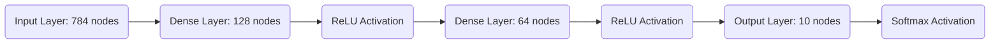

# Neural Network from Scratch 🧠

[](https://opensource.org/licenses/MIT)
[](https://www.python.org/downloads/release/python-3120/)
[](#)

A modular implementation of a Neural Network built entirely with Python and NumPy. This project demonstrates the inner workings of deep learning algorithms including forward propagation, backpropagation, and mini-batch gradient descent.

## 🏗 Architecture



## 🚀 Performance
Successfully achieved **97.04% accuracy** on the MNIST test dataset after 5 epochs of training.

## 🛠 Features
- **Modular Layer System**: Easily add or remove layers.
- **Activations**: Implementation of ReLU and Softmax.
- **Optimization**: Mini-batch Gradient Descent with He Initialization.
- **Persistence**: Save and load models using `pickle`.

## 📦 Installation
```bash
git clone <your-repo-link>
cd "neural network"
python3 -m venv venv
source venv/bin/activate
pip install -r requirements.txt
```

## 🏃 Usage
### Training
```bash
python train.py
```
### Prediction & Visualization
You can view predictions in three modes:
```bash
# View in both CLI and generate PNG (default)
python predict.py both

# View only in CLI (character-based art)
python predict.py cli

# Only generate PNG file
python predict.py png
```
*The CLI view uses character blocks to render the 28x28 digits directly in your terminal!*

## 🌳 Project Visualization
You can view a cool green-colored representation of the project structure by running:
```bash
python tree_view.py
```

## 📂 Project Structure
```text
.
├── activations.py  # Activation functions (ReLU, Softmax)
├── layers.py       # Layer implementations (Dense)
├── network.py      # Core Neural Network logic
├── train.py        # Training script
├── predict.py      # Prediction & Visualization script
├── utils.py        # Data loading & preprocessing
└── model.pkl       # Trained model weights
```

## 📜 License
Distributed under the MIT License. See `LICENSE` for more information.